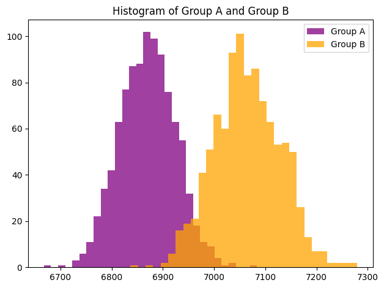

# itmo_ab_2023
Homework for itmo_ab_2023

# Задание 1
### Дизайн теста
1. Из interactions взять данные за 2 последние недели (2021-08-09 по 2021-08-22)

2. Посчитайте на этих данных корректность на бутстрепе и сравните ее с результатами за 1 неделю (посчитано на семинаре) (0.5 балла)

3. На двух неделях посчитайте мощность. Для этого нужно в одну из групп докинуть эффект. Докиньте эффект в 1%, 3% и 5% и сравните полученную мощность (1.5 балла)

4. Посчитайте MDE, который можно зафиксировать на 2х неделях. В качестве alpha и beta подставьте ваши вычисленные ошибки 1 и 2 рода. Учитывайте что у нас формула для MDE работает для t-test или z-test (1 балл)

### A/B тест
1. Представим что у нас прошел тест, используем те же самые данные за 2 недели

2. Занулите для всех пользователей total_dur, у которых total_dur < 500. Их НЕ УБИРАЕМ, а просто обрабатываем эти значения, принимая за нулевые, но пользователей также учитываем в эксперименте (0.5 балла)

3. Разбейте их самостоятельно на две равные группы, используйте функцию groups_splitter и соль = 'kiontestmodel20210805' (0.5 балла)

4. Оказалось, что модель в группе В показала себя лучше, чем в группе А на 2.5%, причем эффект распространился неравномерно и преимущественно на 10% самых смотрящих пользователей, докиньте такой эффект самостоятельно. Нужно метрику total_dur увеличить на 2.5% для 10% пользователей с самым продолжительным смотрением. (1 балл)

5. Посчитайте результат такого теста и сделайте выводы (2 балла)

### Выводы
```
95% Доверительный интервал для разницы средних: (-361.3699729553779, -33.83579571457577)
p-value: 0.018
Нулевая гипотеза (разница равна 0) отвергается: True
```
Значение True указывает, что ноль находится внутри 95% доверительного интервала. В данном контексте это означает, что разница средних значений не является статистически значимой (по уровню значимости 0.05), так как 0 не входит в интервал.
Можно сделать следующий вывод: 
**на основе проведенного бутстрэп-анализа с уровнем доверия 95%, разница средних значений между двумя выборками не является статистически значимой.**



# Задание 2
TODO